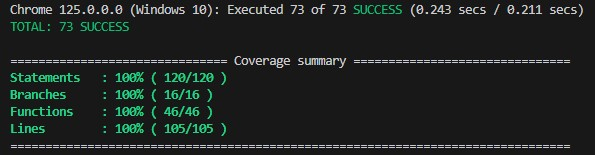
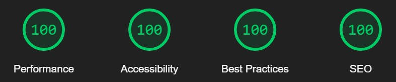

# Aplikacja do przeliczania walut NBP

## Demo

[Link do aplikacji](https://master--currency-converter-nbp.netlify.app/)

## Cel projektu

Utworzenie aplikacji do przeliczania walut, wykorzystując wyłącznie najnowsze narzędzia i techniki programistyczne związane z Angular na 01.02.2025.

## Wymagania funkcjonalne i niefunkcjonalne

- Aplikacja powinna pobierać dane o kursach walut z API Narodowego Banku Polskiego
- Na stronie głównej powinny być wyświetlane aktualne kursy walut z możliwością wyboru daty waluty
- Użytkownik powinien mieć możliwość przeliczenia kwoty z jednej waluty na drugą. Do tego celu powinien być dostępny formularz, w którym użytkownik może wprowadzić kwotę i wybrać waluty
- Aplikacja powinna być responsywna i dobrze wyglądać na różnych urządzeniach
- Aplikacja powinna spełniać standardy WCAG 2.1 AA
- UI powinien być czytelny i atrakcyjny

## Technologie i narzędzia

- Angular v19 SSR zoneless
- Node v20.11.1
- TypeScript v5.7
- Scss
- Jasmine, Karma
- Eslint
- Prettier

## Założenia programistyczne

- Aplikacja jest napisana w najnowszych technologiach
- Aplikacja nie korzysta z żadnych gotowych bibliotek zewnętrznych
- Są zastosowane techniki optymalizacyjne, aplikacja posiada same **100** w `lighthouse`
- `Zone.js` został usunięty z projektu
- Pokrycie kodu testami na poziomie **100%**
- Aplikacja wspiera motyw jasny i ciemny, w zależności od preferencji urządzenia
- Aplikacja korzysta z `experimental` i `dev preview` API
- Są skonfigurowane `eslint`, `prettier`
- Aplikacja została przetestowana ręcznie na przeglądarkach Chrome, Edge, Firefox oraz Safari na urządzeniu iOS
  
## Struktura projektu

```                    
public/                 publiczne pliki
reports/                wygenerowane raporty
src/                         
|- app/                      
|  |- data/             dane statyczne
|  |- features/         komponenty z logiką
|  |- layout/           układy stron
|  |- models/           definicje modeli
|  |- pages/            strony
|  |- store/            stan globalny
|  |- ui/               reużywalne komponenty
|  |- utils/            funkcje pomocnicze
```

## FAQ

### Dlaczego takie technologie i styl kodowania?

Aby zaprezentować najnowsze możliwości frameworka Angular, aplikacja korzysta z najlepszych praktyk zatwierdzonych przez twórców oraz przyjętych w społeczności programistów i przedstawia, w jaki sposób w przyszłości będą tworzone nowe aplikacje. Wiele wykorzystanych API jest na razie eksperymentalnych albo w wersji dev preview, dlatego w projektach komercyjnych nie zaleca się ich stosowania.

### Dlaczego jest taka struktura projektu?

Dana struktura projektu jest dobra dla prostych aplikacji. Nie ma sensu robić overengineeringu i dodawać dodatkowych abstrakcji, ponieważ nie ma w planach rozwijać tej aplikacji.

### Czemu są domyslne HTML inputy?

Aby aplikacja była jak najprostsza, nie posiada żadnych bibliotek komponentów, a tworzenie własnych nie jest głównym celem tego projektu. Domyślne inputy spełniają wszystkie wymagania aplikacji, chociaż posiadają własne problemy.

### Po co jest przycisk do zatwierdzania daty?

Domyślny HTML datepicker pozwala na wprowadzenie daty ręcznie. Aby nie blokować tej funkcjonalności dla użytkownika, został dodany przycisk do zatwierdzenia, aby zminimalizować ilość zapytań oraz wyeliminować błędy związane z wprowadzeniem niepełnej daty.

### Po co jest przycisk przelicz?

Ze względu na dostępność: inną opcją było automatyczne przeliczanie walut, ale to wymagałoby dodatkowego UI z wyjaśnieniem dla użytkownika, że wartości w formularzu są przeliczane automatycznie.

### Czemu wszystko jest na 1 stronie?

To daje lepszy UX na wszystkich urządzeniach. Aplikacja jest zbyt prosta i posiada zbyt mało funkcjonalności, aby dzielić ją na różne strony.

### Czemu nie ma walidacji kwoty?

Wielkie kwoty nie są blokowane, ponieważ z tej aplikacji korzystają wyłącznie milionerzy.
Zero nie wpływa na wynik przeliczeń.
Ujemne kwoty można by było zablokować, ale znak minusa nie wpływa na poprawność przeliczeń, chociaż nie ma logicznego sensu.

## Uruchomienie wersji developierskiej

- npm install
- npm start

## Raporty

### Coverage



### Lighthouse


